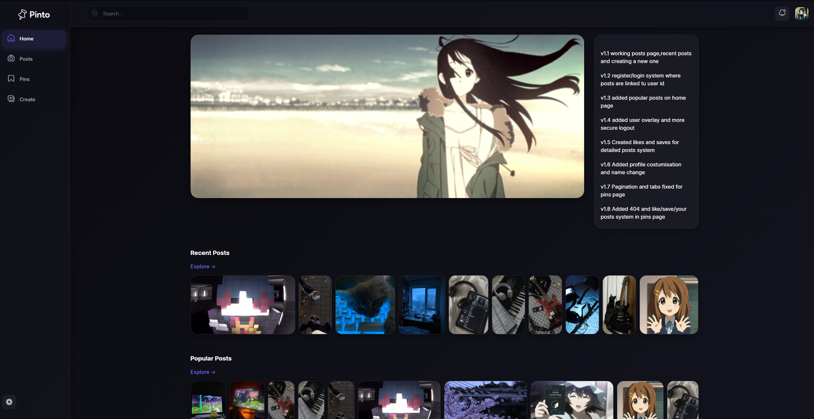
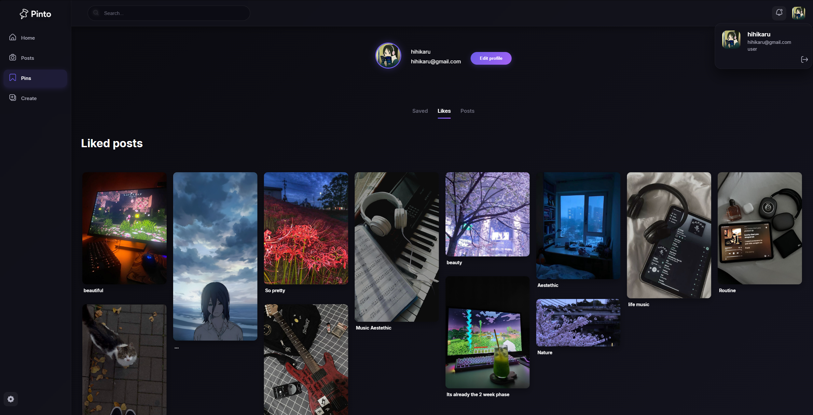

# 📌 Pinto - Pinterest-Inspired Social Media Platform

<div align="center">

A modern, responsive web application for sharing, discovering, and organizing visual content. Built with PHP, CSS, JavaScript, and MySQL.

[](https://www.php.net/)
[](https://developer.mozilla.org/en-US/docs/Web/JavaScript)
[](https://developer.mozilla.org/en-US/docs/Web/CSS)
[](https://www.mysql.com/)

</div>

---

## 📸 Project Preview

<div align="center">






</div>

---

## 🎯 Overview

Pinto is a feature-rich Pinterest-inspired platform that enables users to discover, save, and share visual content. The application demonstrates proficiency in full-stack web development with a focus on user experience, security, and responsive design.

---

## ✨ Key Features

### 🏠 **Homepage**
- Animated GIF banner showcasing platform highlights
- Latest posts in a dynamic feed
- Trending and popular posts section

### 🎨 **Masonry Grid Layout**
- Pinterest-style responsive grid layout with variable-height images
- Smooth interactions and visual polish
- Fully responsive design

### 📄 **Post Details Page**
- High-quality post image display
- Author profile information with avatar
- Engagement metrics (likes, saves count)
- Post creation timestamp
- Like and save functionality
- Post title and detailed description
- Related posts recommendations

### 👤 **User Profile System**
- Three intuitive tabs for content organization:
  - **Liked Posts** - All saved likes
  - **Saved Posts** - Bookmarked content
  - **My Posts** - User-created content with full control
- Edit post metadata (title, description, tags)
- Delete post functionality
- Profile customization:
  - Avatar/profile picture upload
  - Username editing

### ➕ **Post Creation**
- URL-based image import
- Direct file upload
- Metadata configuration:
  - Post title
  - Detailed description
  - Category selection
  - Tag system for discoverability

### 🔐 **Authentication & Security**
- User registration system
- Secure login with session management
- Password hashing (industry-standard encryption)
- Session persistence and remember-me functionality
- Account logout functionality

### ⚙️ **Additional Features**
- User menu modal with account options
- Developer console easter egg with creative styling
- Fully responsive and mobile-optimized design

---

## 🛠️ Technology Stack

| Layer | Technologies |
|-------|--------------|
| **Frontend** | HTML5, CSS3, JavaScript (ES6+) |
| **Backend** | PHP 7+ |
| **Database** | MySQL |
| **Server** | XAMPP/Apache |

---

## 📊 Project Statistics

- **PHP**: 73.4%
- **CSS**: 16.7%
- **JavaScript**: 7.2%
- **Hack**: 2.7%

---

## 🚀 Installation & Setup

### Prerequisites
- XAMPP (or Apache with PHP and MySQL)
- PHP 7.0+
- MySQL 5.7+

### Steps

1. **Clone the repository**
   ```bash
   git clone https://github.com/Frade11/Pinto.git
   cd Pinto
   ```

2. **Configure XAMPP**
   - Place project in `htdocs` directory
   - Start Apache and MySQL services

3. **Database Setup**
   - Create a new MySQL database
   - Import the provided SQL schema
   - Update database credentials in config files

4. **Run the Application**
   - Navigate to `http://localhost/Pinto`
   - Create an account and start sharing content

---

## 💡 Key Development Highlights

### Security Implementation
- ✅ Password hashing with secure algorithms
- ✅ Session-based authentication
- ✅ SQL injection prevention
- ✅ XSS protection measures

### User Experience
- ✅ Intuitive navigation and layout
- ✅ Smooth animations and transitions
- ✅ Fast image loading optimization
- ✅ Responsive and adaptive layouts
- ✅ Accessible UI/UX patterns

### Code Quality
- ✅ Modular architecture
- ✅ Clean, maintainable code structure
- ✅ Efficient database queries
- ✅ Responsive and adaptive layouts

---

## 📱 Responsive Design

The application is fully optimized for all devices:
- 📲 Mobile phones (320px+)
- 📱 Tablets (768px+)
- 💻 Desktop (1024px+)
- 🖥️ Large screens (1920px+)

---

## 🎨 Visual Design

- Clean, modern interface inspired by Pinterest
- Smooth transitions and micro-interactions
- Professional color scheme and typography
- Consistent design language throughout

---

## 📝 Usage Examples

### Creating a Post
1. Navigate to "Create Post" section
2. Upload image via URL or direct upload
3. Add title, description, and category
4. Add relevant tags for discovery
5. Publish to your profile

### Managing Content
1. Visit your profile
2. Switch between Liked, Saved, and My Posts tabs
3. Edit or delete your own posts
4. Update profile information

---

## 🔄 Future Enhancements

- [ ] Social following system
- [ ] Comment functionality
- [ ] Advanced search and filtering
- [ ] Real-time notifications
- [ ] White mode theme
- [ ] API endpoints for mobile apps

---

## 👨‍💻 Developer

**Frade11** - Full Stack Web Developer

- Proficient in PHP, JavaScript, CSS, and MySQL
- Experienced in building responsive, user-centric web applications
- Skilled in security implementation and best practices
- Passionate about clean code and excellent UX/UI design

---

## 📄 License

© 2026 Your Name.  
All rights reserved.  

This project is **not open source**.  
You may view this repository, but **copying, modifying, or distributing** this project is **not allowed** without explicit permission from the author.

---

## 🤝 Contributing

This project is maintained solely by the author.  
No contributions, forks, or pull requests are accepted.


---

<div align="center">

**Made with ❤️ by Frade11**

⭐ If you find this project helpful, please consider giving it a star!

</div>
